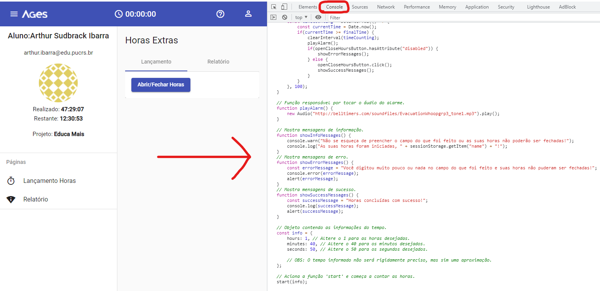

# Fluxo AGES Horas

Automatize o abrimento e fechamento de horas no site do Fluxo AGES.
  
Este projeto **NÃO** estimula o forjamento de horas dentro do Fluxo AGES, possuindo apenas o intuito de possibilitar com que os alunos planejem quantas horas desejam investir no cumprimento de suas tarefas sem correrem o risco de esquecerem as horas abertas.

### Como usar:

Copie o código dentro de `main.js`, cole-o no console do site do Fluxo AGES na **tela de abrir/fechar horas** e pressione enter.

